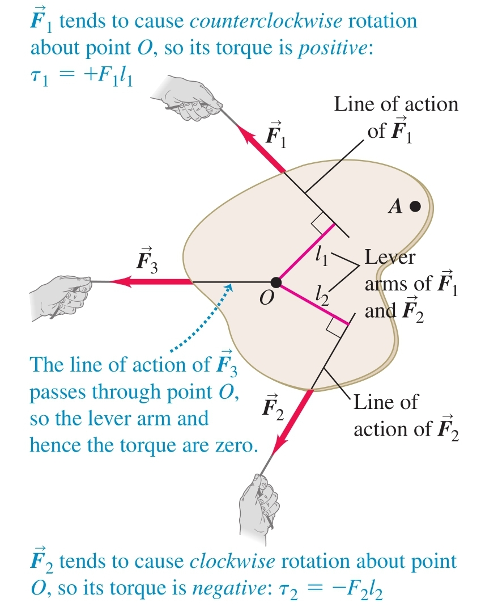

1. Torque ( $\tau, [\text{N}\cdot\text{m}]$ ) - the tendency of a force to change an object's rotational motion about a certain point
	
	$$\tau = Fl$$
	
	
	
	**a) lever arm** ( $l$ ) - the distance between the axis of rotation and the force's line of action
	
	**b) sign**
	- positive - the torque induces counterclockwise rotation
	- negative - the torque induces clockwise rotation
	
	**c) vector representation**
	
	$$\vec{\tau} = \vec{r}\times\vec{F}$$
	
	
	
	**d) rigid-body angular  acceleration**
	
	$$\tau = I\alpha$$
	
	Derivation:
	Suppose that a force $\vec{F}$ acts on the $i$-th mass component of a rigid body, $m_i$, located a distance $r_i$ from the axis of rotation (the z-axis, for example). Only the force component which is tangent to the circle with radius $r_i$ (and is not parallel to the axis of rotation) induces torque on the mass component:
	
	$$\tau_i = F_{\text{tan}}r_i = m_ia_{\text{tan},i}r_i = m_ir_i^2\alpha = I_i\alpha$$
	
	The body is rigid so the angular acceleration is the same for all of its components. Therefore, the net torque is given by
	
	$$\tau = \sum_{i=1}^n \tau_i = \alpha\sum_{i=1}^n I_i = I\alpha$$
	
	- centre of mass and angular acceleration - the rotation of a rigid body can be described by the following equation provided that the axis through the centre of mass is an axis of symmetry and that the axis does not change direction
	
	$$\tau_{\text{net}} = I_{\text{cm}}\alpha$$

2. Angular Momentum
	
	$$\vec{L} = \vec{r}\times\vec{p}$$
	
	
	**a) magnitude and direction**
	- direction - perpendicular to the plane of rotation 
	- magnitude: $L = mvr\sin \phi = mvl$
	
	**b) rate of change** - the torque of the net force
	
	$$\frac{d\vec{L}}{dt} = \vec{\tau}$$
	
	Derivation:
	
	$$\frac{d\vec{L}}{dt} = \frac{d}{dt}(\vec{r}\times\vec{p}) = \frac{d\vec{r}}{dt}\times\vec{p} + \vec{r}\times\frac{d\vec{p}}{dt}$$
	
	The first term is zero because it contains the cross product of $\vec{v}$ with itself. The second term is equal to $\vec{r}\times\vec{F}$, which is equal to the net torque.
	
	**c) rigid bodies**
	- for an axis of rotation that is an axis of symmetry
	
	$$\vec{L} = I\vec{\omega}$$
	
	Derivation:
	
	
	
	Every component of a rigid body is moving in a circle with the same angular velocity $\omega$. Since the velocity at each point of the circle is tangent to its position vector, the magnitude of the angular momentum for the $i$-th component is given by
	
	$$L_i = m_iv_ir_i = m_i(r_i\omega)r_i = m_ir_i^2\omega$$
	
	The total angular momentum for the slice is
	
	$$L = \sum_{i=1}^n L_i = \omega\sum_{i=1}^n m_ir_i^2 = I\omega$$
	
	Now, we need to add the angular momenta of the rest of the slices, but the position vectors for their elements have z-components and so their angular momenta will have components perpendicular to the z-axis. Fortunately, if the rotational axis is an axis of symmetry, these z-components will cancel out for the elements on opposite sides of the axis and so the angular momentum vector will lie on the same line as the angular velocity
	
	- rotational axis is *not* an axis of symmetry - the angular momentum vector traces out a cone around the axis of rotation which means that there is a net external torque even though the angular velocity may be constant
	
	**d) conservation of angular momentum** - when the total net external torque is zero, the angular momentum of a system is constant
	
	**e) precession** - applying a torque to an object which already has angular momentum may result in peculiar motion
	
	
	
	The wheel is spinning around an axis of symmetry and has an initial angular momentum due to this rotation equal to $\vec{L}_i$. Its weight pulls down on it and so generates a torque $\vec{\tau}$ perpendicular to $\vec{L}$. This torque causes a change in the angular momentum which wants to follow the torque and so the wheel does not fall but its axis rather rotates.
	- precession angular speed - the change in the direction of angular momentum
	
	$$\Omega = \frac{wr}{I\omega}$$