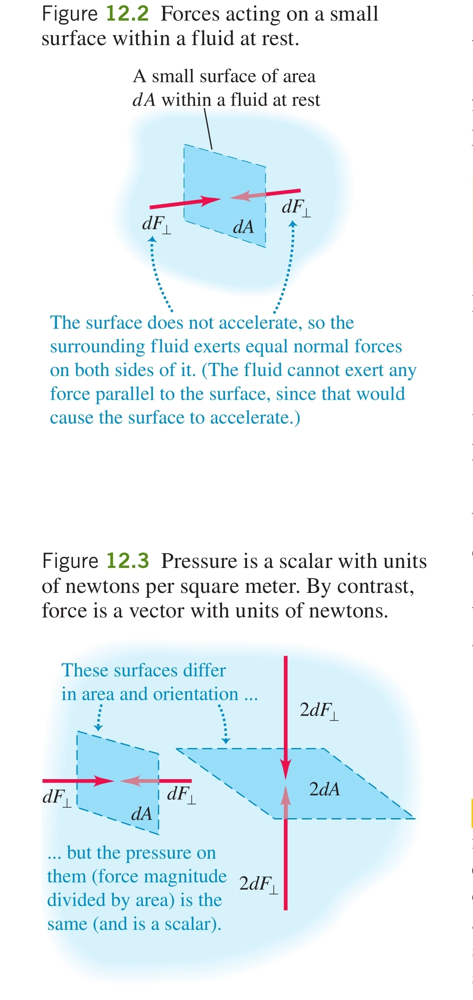

1. Fluid - any substance which can flow and change the shape of the volume it occupies
	
	**a) liquids** - fluids with *cohesion*
	- they change the shape of the volume they occupy but not the volume itself
	
	**b) gases** - fluids without cohesion
	- capable of changing the volume itself

2. Density ( $\rho, [\text{kg/m³}]$ ) - the mass contained in a unit of volume
	
	$$\rho = \frac{m}{V}$$
	
	**a) properties** - things made from the same material have the same density
	
	**b) specific gravity** (relative density) - a pure number which is the ratio of the density of a material to the density of water at 4°C
	- terrible misnomer

3. Pressure ( $p, [\text{Pa}]$ ) - the force perpendicular to a surface that a fluid exerts over the area of the surface
	
	$$p = \frac{dF_{\perp}}{dA}$$
	
	
	
	**a) units**
	- $\text{Pa = N/m²}$ - pascal
	- $\text{bar} = 10^5 \text{ Pa}$
	- $\text{atm} = 101,325 \text{ Pa} \approx 1.013 \times 10^5 \text{ Pa}$ - average atmospheric pressure at sea level
	
	**b) Pascal's law** - pressure applied to an enclosed fluid is transmitted undiminished to every portion of the fluid and the walls of its container
	
	**c) depth and pressure** - persuant to Pascal's law, the pressure in a fluid increases with depth because the upper layers of the fluid exert pressure on the lower ones
	
	$$p = p_0 + \rho gh$$
	- $p$ - pressure at depth $h$
	- $p_0$ - pressure at the surface of the fluid
	
	Derivation:
	
	
	
	Imagine an element of a fluid which is at rest and which has a top and bottom surface area $A$, is located at an elevation $y$ from the bottom of the container and has thickness $dy$. Its mass and weight are $dm$ and $dw$, its density $\rho$ its volume $dV$.
	
	Call the pressure at the bottom surface $p$ and the pressure at the top surface $p + dp$, where $dp$ is the change in pressure we are trying to find. 
	
	The forces acting on the fluid element are its weight as well as the upward force the rest of the fluid exerts on the bottom of the element and the downward force it exerts on the top of the element (the sideways forces cancel out). Since the element is at equilibrium, the net force acting on it is zero:
	
	$$dw + dF_{\text{up}} + dF_{\text{down}} = 0$$
	
	$$-dmgdV + pA - (p + dp)A = 0$$
	
	$$pA - (p + dp)A - \rho gAdy = 0$$
	
	Dividing out the area and rearranging...
	
	$$\frac{dp}{dy} = -\rho g$$
	
	Therefore, the pressure decreases as $y$ increases - moving upward means that you experience less pressure.
	
	Integrating both sides of the equation, we can obtain an expression for the total pressure difference between two points:
	
	$$\int_{y_1}^{y_2} \frac{dp}{dy} dy = \int_{y_1}^{y_2} -\rho g dy$$
	
	$$p_2 - p_1 = -\rho g (y_2 - y_1)$$
	
	In order to represent the pressure difference based on a depth from the surface, we can take $p$ to be the pressure at point 1 (the former $p_1$ and $p_0$ (0 for zero depth) to be the pressure at the surface (point 2, formerly $p_2$).
	
	
	
	The depth is $h = y_2 - y_1$ and so
	
	$$p_0 - p = -\rho gh$$
	
	By rearranging, we obtain that
	
	$$p = p_0 + \rho gh$$
	
	**d) relations to atmospheric pressure**
	- gauge pressure - the difference between the pressure inside a system and the atmospheric pressure outside it
	- absolute pressure - the total pressure including atmospheric pressure